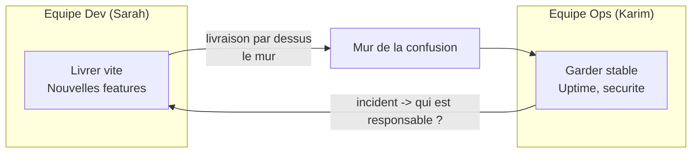
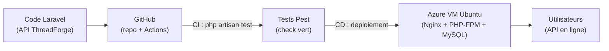
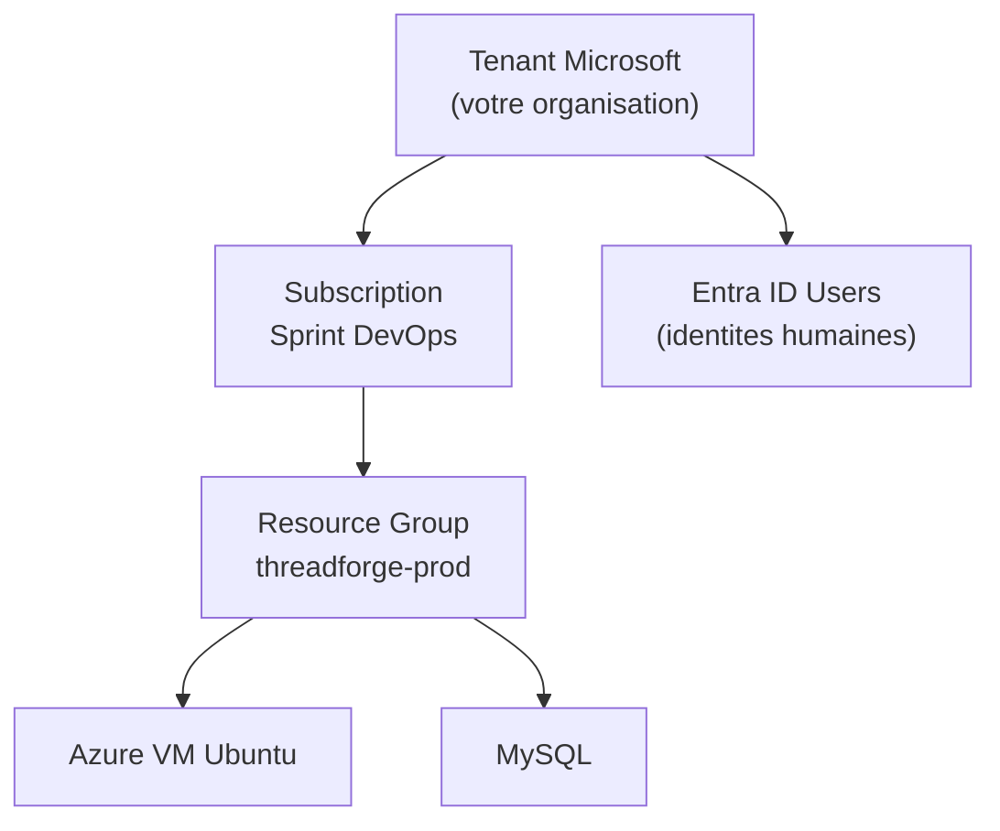
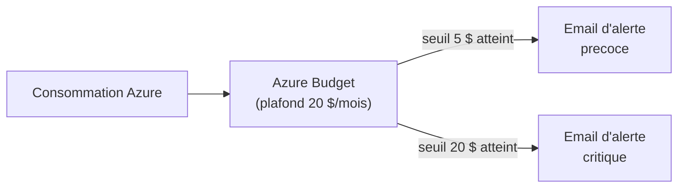
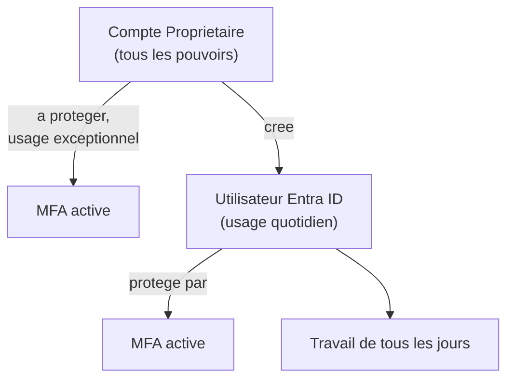

# Simplon Maroc - Dev Backend

# Sprint DevOps (ThreadForge Part 2) - Semaine 1 - Séance 1 : Introduction DevOps, Culture et Création de la Subscription Azure

## Objectifs pédagogiques

- Expliquer l'origine de DevOps et la rupture avec le modèle « Dev vs Ops »
- Décrire la culture DevOps via le framework CALMS et les métriques DORA
- Créer et sécuriser une Subscription Azure destinée à héberger l'API ThreadForge
- Mettre en place la maîtrise des coûts (budget et alertes) dès la première séance

## Objectifs techniques

DevOps, silos Dev/Ops, CALMS, métriques DORA, Tenant Azure, Subscription, Resource Group, Azure Free Trial, Azure Cost Management + Budgets, Entra ID (ex-Azure AD), MFA, compte propriétaire

## Table des matières

1. [Pourquoi DevOps : du mur Dev/Ops à la collaboration](#1-pourquoi-devops--du-mur-devops-à-la-collaboration)
2. [La culture DevOps : CALMS et métriques DORA](#2-la-culture-devops--calms-et-métriques-dora)
3. [Le fil conducteur : ThreadForge, de ton code à la production](#3-le-fil-conducteur--threadforge-de-ton-code-à-la-production)
4. [Créer sa Subscription Azure](#4-créer-sa-subscription-azure)
5. [Maîtriser les coûts : budget et alertes Azure Cost Management](#5-maîtriser-les-coûts--budget-et-alertes-azure-cost-management)
6. [Sécuriser la Subscription : Entra ID et MFA](#6-sécuriser-la-subscription--entra-id-et-mfa)
7. [Récapitulatif et prochaines étapes](#7-récapitulatif-et-prochaines-étapes)
8. [Ressources complémentaires](#8-ressources-complémentaires)

**Déroulé de la séance (Type Découverte, 2h)** :

- 0–35 min : Théorie. Pourquoi DevOps, culture CALMS/DORA, projet et architecture cible (sections 1 à 3)
- 35–55 min : LAB 1. Création de la Subscription Azure
- 55–80 min : LAB 2. Budget et alertes Azure Cost Management
- 80–110 min : LAB 3. Utilisateur Entra ID et MFA
- 110–120 min : Récapitulatif et 3 points clés

---

## 1. Pourquoi DevOps : du mur Dev/Ops à la collaboration

### 1.1 Deux équipes, deux objectifs opposés : l'histoire de MediSoft

**Vendredi 18h, 2014. Société MediSoft (éditeur logiciel).**

Sarah est développeuse Java. Elle vient de finir une nouvelle fonctionnalité : la **prise de rendez-vous en ligne**. L'application est utilisée par le cabinet du Dr Bensalah. Sarah est fière. Les secrétaires médicales vont gagner deux heures par jour. Elle écrit à l'équipe Ops : *« Feature prête, à déployer ce week-end. »*

**19h.** Karim est administrateur système. Il ouvre le mail. Il soupire. La dernière fois, Sarah avait livré quelque chose « prêt ». Il avait passé sa nuit du samedi sur le serveur. Le problème : il fallait Java 11, pas Java 8. Cette fois il anticipe. Il décale le mariage de son cousin.

**Samedi 23h.** Karim lance le déploiement. La fonctionnalité écrit dans une nouvelle table de la base. Mais Sarah n'a pas fourni le script de migration. La base plante. Karim tente un rollback. Échec : un autre module poussé deux jours plus tôt est incompatible. À **4h du matin**, Karim rétablit la version précédente. La fonctionnalité de Sarah n'est pas en production.

**Lundi 8h30.** Le Dr Bensalah arrive au cabinet. Les secrétaires lui annoncent une mauvaise nouvelle. Les **trente patients** qui ont réservé en ligne ne sont pas dans le système. Salle d'attente bondée. Téléphone qui sonne. Le médecin appelle MediSoft, furieux.

**9h, réunion de crise.** Sarah accuse Karim. Il aurait « cassé son code en production ». Karim accuse Sarah. Elle aurait livré « sans tests, sans doc, sans script de migration ». Le directeur exige un coupable. Personne ne reconnaît sa part. Deux semaines plus tard, **le cabinet résilie son contrat**.

---

Cette histoire n'a rien d'extrême : c'est le quotidien de milliers d'éditeurs entre 2000 et 2010, et c'est exactement ce qui a fait émerger DevOps. Chaque équipe est **rationnelle dans son périmètre** :

- Sarah est évaluée sur **le nombre de features livrées** → elle pousse pour livrer vite
- Karim est évalué sur **l'uptime du serveur** → il freine pour préserver la stabilité

Leurs objectifs s'opposent **par construction**. Entre les deux : un **mur**. Le code part « par-dessus » sans discussion, et chaque incident déclenche la recherche d'un coupable plutôt que la résolution du problème.

Conséquences typiques : délais de livraison de plusieurs mois, **30 à 40% de déploiements en échec**, équipes démotivées et turnover élevé. DevOps est né exactement de cette frustration : casser le mur, partager les objectifs, et faire en sorte que **Sarah et Karim soient dans la même équipe**.

> **Et vous dans tout ça ?** Jusqu'ici, vous avez été Sarah : vous développez, vous testez en local, et le déploiement était « le problème de plus tard ». Pendant ce sprint, vous devenez Sarah **et** Karim à la fois : vous êtes responsables de votre code jusqu'à la production.

### 1.2 La réponse DevOps

DevOps (Development + Operations) est un mouvement né en 2009 qui casse ce mur. C'est d'abord une **culture** (responsabilité partagée de bout en bout), soutenue par des **pratiques** automatisées : intégration continue, déploiement continu, Infrastructure as Code, supervision.

L'idée centrale de ce sprint : **on n'apprend pas un outil pour lui-même, on l'apprend parce que le projet en a besoin** pour passer du code à la production de façon fiable et rapide.

---

## 2. La culture DevOps : CALMS et métriques DORA

### 2.1 Le framework CALMS

CALMS résume en cinq piliers ce qui fait une culture DevOps saine. Reprenons l'histoire de MediSoft : voici ce que chaque pilier change concrètement.

- **Culture** : collaboration et confiance entre Dev et Ops.

  *Exemple : après l'incident des 30 patients, MediSoft instaure un standup quotidien. Sarah et Karim y discutent les features à venir. Chaque incident déclenche un post-mortem **blameless**. On analyse le système, jamais les personnes.*

- **Automation** : automatiser les tâches répétitives pour réduire les erreurs.

  *Exemple : fini le déploiement manuel du samedi soir. Un pipeline CI/CD (GitHub Actions) prend le relais. Il joue les tests, applique les migrations, déploie en production. Le « Java 8 vs 11 » ne se reproduit plus : la version est fixée dans le pipeline.*

- **Lean** : éliminer les gaspillages, livrer par petits incréments.

  *Exemple : la prise de RDV n'est plus livrée en bloc. Elle est découpée en trois étapes. D'abord la lecture des créneaux. Puis la réservation. Enfin la confirmation par email. Chaque incrément est testé seul. Si ça casse, le périmètre du problème est minuscule.*

- **Measurement** : mesurer pour décider et s'améliorer.

  *Exemple : MediSoft installe un tableau de bord de suivi. Il affiche le nombre de RDV créés et le temps de réponse de l'API. Les décisions ne se prennent plus à l'intuition. Sarah et Karim partagent les mêmes chiffres.*

- **Sharing** : partager les connaissances et les responsabilités.

  *Exemple : Karim documente ses procédures Ops dans le repo. Sarah documente ses scripts de migration. Quand l'un est absent, l'autre prend le relais. La règle « **you build it, you run it** » remplace les silos.*

### 2.2 Les quatre métriques DORA

DORA (DevOps Research and Assessment, Google) mesure scientifiquement la performance de livraison sur quatre indicateurs et classe les équipes en **quatre niveaux** : Low, Medium, High, Elite.

| Métrique | Question | Low | Medium | High | Elite |
| --- | --- | --- | --- | --- | --- |
| **Deployment Frequency** | Fréquence de déploiement ? | < 1× / 6 mois | 1× / mois → 1× / 6 mois | 1× / sem → 1× / mois | À la demande (plusieurs × / jour) |
| **Lead Time for Changes** | Délai commit → production ? | > 6 mois | 1 mois → 6 mois | 1 jour → 1 semaine | < 1 heure |
| **Change Failure Rate** | % déploiements à corriger ? | 46–60 % | 31–45 % | 16–30 % | 0–15 % |
| **Time to Restore Service** | Temps pour restaurer après incident ? | > 6 mois | 1 jour → 1 semaine | < 1 jour | < 1 heure |

> **Repère MediSoft (avant DevOps)** : déploiement ~1× / mois, lead time ~2 mois, taux d'échec ~35 %, restauration ~8h. C'est typiquement le profil **Medium → Low**. Votre objectif : à la fin de ce sprint, un push sur ThreadForge doit arriver en production en quelques minutes, tests passés — le comportement d'une équipe **High**.

Ces quatre métriques seront notre boussole : chaque séance du sprint (tests automatisés, CI, déploiement) sert à les améliorer concrètement sur ThreadForge.

---

## 3. Le fil conducteur : ThreadForge, de ton code à la production

### 3.1 Votre projet, la suite

L'histoire de Sarah et Karim s'est passée sur le logiciel d'un éditeur. Vous, vous avez déjà votre application : **ThreadForge**, l'API REST Laravel que vous avez construite au sprint précédent — authentification Sanctum, endpoints REST, Jobs/Queues, tests Pest.

La grande différence avec ThreadForge Part 1 : **le code, vous l'avez déjà écrit**. Le travail de ce sprint n'est pas de développer de nouvelles features. Il est de **mettre en production, automatiser et fiabiliser** ce qui existe : chaque push doit déclencher les tests, et chaque version validée doit se retrouver en ligne sans intervention manuelle.

### 3.2 L'architecture cible du sprint

### 3.3 Pourquoi Azure, et pourquoi la sécurité dès le premier jour

ThreadForge manipule des **comptes utilisateurs**, des **mots de passe hashés**, des **tokens d'API Sanctum** et du **contenu publié par les utilisateurs**. Ce sont des données personnelles : la sécurité n'est pas optionnelle.

On part sur **Azure**, deuxième cloud mondial et le plus présent en entreprise européenne (Microsoft est partenaire historique des ESN au Maghreb — vous croiserez Azure en poste). On applique dès aujourd'hui deux réflexes de production : **maîtriser les coûts** (une Subscription mal surveillée peut générer des factures imprévues) et **sécuriser les accès** (ne jamais travailler avec le compte propriétaire tout-puissant au quotidien).

C'est l'objet des trois LABs de cette séance.

### 3.4 Le vocabulaire Azure de base

Avant les LABs, fixons trois mots qui reviendront partout :

- **Tenant** : votre organisation dans Microsoft Cloud. Il contient les utilisateurs (Entra ID) et peut héberger plusieurs Subscriptions.
- **Subscription** : conteneur de facturation. Toutes les ressources que vous créez (VM, base de données...) sont rattachées à une Subscription. C'est ici qu'arrive la facture.
- **Resource Group (RG)** : conteneur logique de ressources liées (ex: « threadforge-prod » contiendra la VM et tout ce qui va avec). Permet de tout supprimer d'un coup.

---

## 4. Créer sa Subscription Azure

La Subscription Azure est la fondation de tout le reste du sprint : sans elle, pas de VM, pas de déploiement. On la crée maintenant, ensemble.

### 4.1 Le Free Trial Azure

Microsoft offre aux nouveaux comptes :

- **200 $ de crédits** valables **30 jours** pour explorer tous les services
- **12 mois de services gratuits** sur une liste limitée (B1s VM, 250 GB de Blob Storage, etc.)
- **Services « always free »** : Azure Functions limitées, Cosmos DB free tier, etc.

Le Free Trial nécessite une carte bancaire (vérification d'identité) mais **ne facture rien** automatiquement à la fin des 30 jours. Pour continuer à utiliser des services payants après les 30 jours, on bascule explicitement en **Pay-As-You-Go**. C'est exactement ce que ferait une entreprise.

> Alternative : **Azure for Students**. Si vous avez encore une adresse email étudiante valide, vous obtenez **100 $ de crédits** sans carte bancaire, valables 12 mois. À tester avant le Free Trial classique.

### 4.2 Application pratique

📝 **LAB 1** - Création de la Subscription Azure : `devops_s1_lab1_creation_subscription_azure.md`

**Énoncé du LAB 1** :

- Objectif : créer une Subscription Azure via le Free Trial et se connecter au Portal
- Contexte : cette Subscription hébergera l'API ThreadForge pour la durée du sprint. $200 de crédits valables 30 jours, puis bascule manuelle en Pay-As-You-Go
- Instructions : créer le compte sur `azure.microsoft.com/free`, vérifier identité (email + téléphone + carte bancaire), choisir Free Trial, accéder au Portal sur `portal.azure.com`
- Critères d'évaluation : Subscription active visible dans le Portal, $200 de crédits affichés, capture d'écran du Portal
- Durée estimée : 20 min

---

## 5. Maîtriser les coûts : budget et alertes Azure Cost Management

Azure facture à l'usage. Un réflexe de production : poser un garde-fou financier **avant** de créer la moindre ressource. On configure un budget mensuel et des alertes par email via le service **Cost Management + Billing**.

### 5.1 Le garde-fou financier

### 5.2 Particularité Azure : Cost Management vs Budgets

Sur Azure, deux outils complémentaires :

- **Cost Analysis** : tableau de bord qui montre les coûts en temps réel par service, par RG, par tag.
- **Budgets** : alertes proactives quand un seuil est atteint. C'est ce qu'on configure aujourd'hui.

### 5.3 Application pratique

📝 **LAB 2** - Budget et alertes Azure Cost Management : `devops_s1_lab2_budget_alertes_azure.md`

**Énoncé du LAB 2** :

- Objectif : créer un budget mensuel et des alertes email pour éviter toute facture imprévue
- Contexte : la règle de la classe est une alerte à 5 $ et un seuil critique à 20 $/mois
- Instructions : accéder à Cost Management depuis le Portal, créer un Budget mensuel de 20 $, ajouter deux alertes (à 25% = 5 $ et 100% = 20 $ de coût réel), confirmer la réception de l'email
- Critères d'évaluation : budget créé, deux seuils d'alerte configurés, email de confirmation reçu
- Durée estimée : 25 min

---

## 6. Sécuriser la Subscription : Entra ID et MFA

La Subscription que vous venez de créer est rattachée à un compte **Propriétaire** (le compte que vous avez utilisé pour le signup). Ce compte a tous les pouvoirs, y compris fermer la Subscription ou changer le moyen de paiement. On ne travaille **jamais** au quotidien avec ce compte. On le protège par une double authentification (MFA), puis on crée un utilisateur Entra ID pour l'usage courant.

### 6.1 Propriétaire vs utilisateur Entra ID

### 6.2 Vocabulaire Azure : RBAC

Sur Azure, donner des permissions = **assigner un rôle RBAC** (Role-Based Access Control) à un utilisateur, à un scope précis (Subscription, RG, ou ressource). Quelques rôles courants :

- **Owner** : tous les droits, y compris gestion d'accès
- **Contributor** : tout sauf gestion d'accès
- **Reader** : lecture seule

Pour ce sprint, l'utilisateur `devops-<prénom>` recevra le rôle **Owner** au scope Subscription. C'est large mais simple. En entreprise on découperait plus finement.

### 6.3 Application pratique

📝 **LAB 3** - Utilisateur Entra ID et MFA : `devops_s1_lab3_utilisateur_entraid_mfa.md`

**Énoncé du LAB 3** :

- Objectif : sécuriser la Subscription avec MFA sur le propriétaire et créer un utilisateur Entra ID d'administration
- Contexte : réflexe de production indispensable pour une API qui manipule des comptes, des tokens et des données personnelles
- Instructions : activer un MFA via Microsoft Authenticator sur le compte propriétaire, créer un utilisateur Entra ID `devops-<prénom>`, lui attacher le rôle Owner au scope Subscription, activer le MFA sur cet utilisateur, se reconnecter avec lui
- Critères d'évaluation : MFA propriétaire actif, utilisateur Entra ID créé avec rôle Owner, MFA Entra ID actif et connexion réussie
- Durée estimée : 30 min

---

## 7. Récapitulatif et prochaines étapes

### 7.1 Les 3 points clés à retenir

- DevOps casse le mur Dev/Ops : une culture (CALMS) mesurée par DORA, au service d'une livraison fiable et rapide.
- On maîtrise les coûts Azure **avant** de consommer : Budget + alertes sont un réflexe de production.
- On ne travaille jamais avec le compte propriétaire au quotidien : MFA partout, et un utilisateur Entra ID pour l'usage courant.

### 7.2 Prochaine séance

Séance 2 : Mise en place de l'environnement cloud. Vous lancerez votre première Azure VM Ubuntu et vous y connecterez depuis VS Code via Remote SSH. C'est cette VM qui hébergera ThreadForge en production. La Subscription Azure sécurisée aujourd'hui en est le prérequis direct.

---

## 8. Ressources complémentaires

- [Azure Free Trial](https://azure.microsoft.com/free/) : $200 de crédits offerts, 30 jours
- [Azure for Students](https://azure.microsoft.com/free/students/) : $100 sans carte bancaire si email étudiant
- [Azure Cost Management + Budgets](https://learn.microsoft.com/azure/cost-management-billing/costs/quick-acm-cost-analysis) : documentation officielle
- [Bonnes pratiques Entra ID (Azure AD)](https://learn.microsoft.com/entra/identity/role-based-access-control/best-practices) : sécurisation des accès
- [DORA - Four Keys](https://dora.dev/) : métriques de performance DevOps
- [The DevOps Handbook](https://itrevolution.com/the-devops-handbook/) : ouvrage de référence
