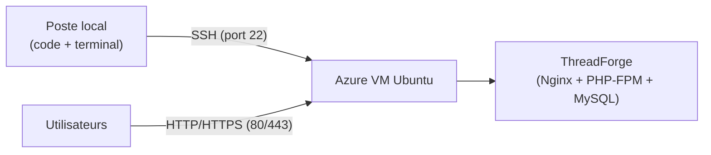
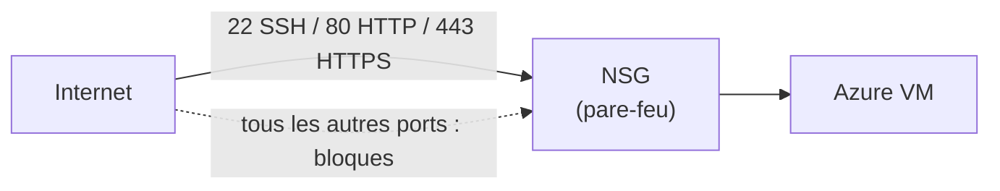

# Simplon Maroc - Dev Backend

# Sprint DevOps (ThreadForge Part 2) - Semaine 1 - Séance 2 : Mise en place de l'environnement cloud (Azure VM + SSH)

## Objectifs pédagogiques

- Expliquer le principe d'une Azure VM et le réflexe « code local, runtime cloud »
- Lancer une Azure VM Ubuntu et gérer sa clé SSH
- Configurer le Network Security Group pour SSH, HTTP et HTTPS
- Se connecter à la VM en SSH depuis un terminal et exécuter ses premières commandes

## Objectifs techniques

Azure VM, image Ubuntu, VM size, clé SSH, Resource Group, Region, Network Security Group (NSG), ports 22/80/443, SSH, arrêt vs deallocate de la VM

## Table des matières

1. [Pourquoi une Azure VM](#1-pourquoi-une-azure-vm)
2. [Anatomie d'une Azure VM](#2-anatomie-dune-azure-vm)
3. [La sécurité réseau : le Network Security Group](#3-la-sécurité-réseau--le-network-security-group)
4. [Se connecter en SSH](#4-se-connecter-en-ssh)
5. [Du clic au code : un mot sur l'Infrastructure as Code](#5-du-clic-au-code--un-mot-sur-linfrastructure-as-code)
6. [Récapitulatif et prochaines étapes](#6-récapitulatif-et-prochaines-étapes)
7. [Ressources complémentaires](#7-ressources-complémentaires)

**Déroulé de la séance (Type Découverte, 2h)** :

- 0–10 min : Correction des LABs de la Séance 1 (Subscription, budget, Entra ID/MFA)
- 10–30 min : Théorie : Azure VM, NSG (sections 1 à 3)
- 30–55 min : LAB 1 - Lancer une Azure VM Ubuntu
- 55–90 min : LAB 2 - NSG et connexion SSH
- 90–105 min : Du clic au code (section 5) + récap
- 105–120 min : **Deallocate** de la VM et vérification du Credit balance

---

## 1. Pourquoi une Azure VM

### 1.1 Code local, runtime cloud

La règle de ce sprint, qui correspond à la pratique réelle en entreprise : **le code s'écrit sur votre poste** (VS Code, vos outils habituels), **il s'exécute sur le serveur**. Vous n'éditerez jamais le code de ThreadForge directement sur la VM : le code voyage par Git, et bientôt par le pipeline GitHub Actions. La VM est le moteur ; votre poste reste le poste de pilotage.

### 1.2 Qu'est-ce qu'une Azure VM

**Azure Virtual Machines** fournit des **serveurs virtuels à la demande** : un serveur Linux que l'on allume en quelques minutes, que l'on utilise, puis que l'on éteint pour ne plus payer. C'est cette VM qui hébergera ThreadForge en production : Nginx, PHP-FPM et MySQL.



### 1.3 Vocabulaire

- **Resource Group (RG)** : conteneur logique qui regroupe la VM + sa NIC + son IP publique + son disque + son NSG. Supprimer le RG supprime tout d'un coup.
- **Region** : zone géographique du datacenter. Pour ce sprint, on fixe **`Belgium Central`** : B-series v2 disponible pour nos comptes, latence depuis le Maroc équivalente à l'Europe de l'Ouest. Règle : **même région pour toutes les ressources**.
- **VM size** : définit CPU + RAM. Pour ce sprint : **`Standard_B2als_v2`** (2 vCPU, 4 Go de RAM, ~35 $/mois si elle tourne 24h/24 — d'où la discipline deallocate).

---

## 2. Anatomie d'une Azure VM

Quatre choix définissent la VM du sprint :

| Choix | Valeur | Pourquoi |
| --- | --- | --- |
| **Image** | Ubuntu Server 24.04 LTS | LTS = support long terme, l'image serveur standard |
| **Size** | `Standard_B2als_v2` (2 vCPU, 4 Go) | Suffisant pour Nginx + PHP-FPM + MySQL. Consomme le crédit 200 $ |
| **Disque OS** | **Standard SSD (LRS)** — pas Premium | Le Premium SSD coûte nettement plus cher pour zéro gain sur notre usage |
| **Authentication** | **SSH public key** (pas de mot de passe) | Azure génère la paire et fait télécharger le `.pem` |

> **La clé privée `.pem` ne se télécharge qu'une seule fois.** Perdue = plus d'accès à la VM. La ranger dans `~/.ssh/threadforge-key.pem` et restreindre ses droits : `chmod 600 ~/.ssh/threadforge-key.pem` (obligatoire, sinon SSH la refuse).

### 2.1 Stop vs Deallocate — la différence qui coûte de l'argent

| État | Comportement | Coût |
| --- | --- | --- |
| **Stop (depuis l'OS, `sudo shutdown`)** | OS éteint, mais Azure réserve le hardware | **Continue à facturer** le compute |
| **Deallocate (bouton Stop du Portal)** | Hardware libéré, l'IP publique peut changer au redémarrage | **Ne facture plus le compute**, juste le disque (quelques centimes/jour) |

> **Règle du sprint** : en fin de séance, toujours **Deallocate** depuis le Portal. Jamais `sudo shutdown` seul, sinon vous payez une VM éteinte.

---

## 3. La sécurité réseau : le Network Security Group

Un **NSG** est un pare-feu virtuel attaché à la VM. Par défaut, tout trafic entrant est bloqué. Pour notre usage, trois ports doivent être ouverts :

| Port | Service | Pourquoi |
| --- | --- | --- |
| **22** | SSH | Administrer la VM depuis le terminal |
| **80** | HTTP | Servir ThreadForge via Nginx |
| **443** | HTTPS | Servir ThreadForge en chiffré (certificat plus tard dans le sprint) |

Le wizard de création de la VM permet de cocher ces trois ports directement (**Inbound port rules** → Allow selected ports → SSH, HTTP, HTTPS). Source : **Any** — vos IP changent entre l'école, la maison et le partage de connexion, on ne restreint pas par IP pour ce sprint.

> **Ce qui nous protège alors** : l'authentification par clé SSH uniquement (pas de mot de passe à bruteforcer). Ouvrez les logs `sudo journalctl -u ssh` après quelques jours : vous verrez des tentatives de connexion automatisées venues du monde entier. C'est l'Internet normal — et c'est pour ça qu'on ne met **jamais** d'authentification par mot de passe sur un serveur exposé.



À savoir : un NSG peut s'attacher au subnet (protège toutes les VM du subnet) ou à la NIC (protège cette VM uniquement). Le wizard crée un NSG au niveau **NIC** : c'est ce qu'on utilise.

---

## 4. Se connecter en SSH

SSH ouvre un terminal distant chiffré sur la VM. On se connecte avec la clé privée `.pem` et l'IP publique de la VM. Depuis Git Bash (Windows) ou un terminal (macOS/Linux/WSL) :

```bash
chmod 600 ~/.ssh/threadforge-key.pem
ssh -i ~/.ssh/threadforge-key.pem azureuser@<IP_PUBLIQUE>
```

L'utilisateur par défaut des images Ubuntu sur Azure est **`azureuser`**. À la première connexion, SSH demande de confirmer l'empreinte du serveur : répondre `yes`.

Pour ne plus retaper la commande complète, créer une entrée dans `~/.ssh/config` (sur le poste local) :

```text
Host threadforge-vm
    HostName <IP_PUBLIQUE>
    User azureuser
    IdentityFile ~/.ssh/threadforge-key.pem
```

Ensuite, la connexion tient en deux mots : `ssh threadforge-vm`.

> **Attention** : après un deallocate, l'IP publique peut changer. Si la connexion échoue au début d'une séance, vérifier l'IP dans le Portal et mettre à jour `~/.ssh/config`.

### 4.1 Application pratique

📝 **LAB unique de la séance** - Créer la VM et s'y connecter en SSH (détails dans le fichier de LAB) :

- Objectif : lancer l'Azure VM Ubuntu qui hébergera ThreadForge et établir la connexion SSH
- Contexte : connecté en `devops-<prénom>`, créer le Resource Group `threadforge-rg` puis la VM `threadforge-vm` (Ubuntu 24.04, `Standard_B2als_v2`, disque Standard SSD, région Belgium Central, ports 22/80/443 ouverts, clé SSH générée et téléchargée)
- Critères d'évaluation : VM en état Running avec la bonne size et le bon disque, clé `.pem` sécurisée (`chmod 600`), connexion SSH réussie, `whoami` retourne `azureuser`, entrée `threadforge-vm` dans `~/.ssh/config`, VM en `Stopped (deallocated)` en fin de séance

---

## 5. Du clic au code : un mot sur l'Infrastructure as Code

Comptez les clics de cette séance : environ vingt-cinq pour une seule VM. En production, on ne refait pas ça à chaque environnement : l'infrastructure se décrit **en code** (Terraform, Bicep), versionnée dans Git comme le reste — une commande pour tout créer, une pour tout détruire. On n'ira pas jusque-là dans ce sprint, mais retenez le principe : **le Portal sert à apprendre et à dépanner ; la production, elle, se décrit en code versionné.** C'est la même logique que ce qu'on fera dès la prochaine séance avec le déploiement : d'abord à la main pour comprendre, ensuite automatisé pour de vrai.

---

## 6. Récapitulatif et prochaines étapes

### 6.1 Les 3 points clés à retenir

- Une Azure VM = un serveur Linux à la demande, défini par image + size + clé SSH + region + Resource Group. La nôtre : Ubuntu 24.04, `Standard_B2als_v2`, Standard SSD, Belgium Central.
- Le NSG est le pare-feu : 22/80/443 ouverts, tout le reste bloqué, et la sécurité d'accès repose sur la clé SSH (jamais de mot de passe).
- On **deallocate** en fin de séance : une VM « éteinte depuis l'OS » facture toujours le compute.

### 6.2 Prochaine séance

Installation de la stack serveur sur la VM (Nginx, PHP, Composer, MySQL) et premier déploiement **manuel** de ThreadForge — pour ressentir tout ce que le pipeline automatisera ensuite.

---

## 7. Ressources complémentaires

- [Azure Virtual Machines - Documentation](https://learn.microsoft.com/azure/virtual-machines/)
- [Connexion SSH à une VM Linux Azure](https://learn.microsoft.com/azure/virtual-machines/linux/mac-create-ssh-keys)
- [Network Security Groups](https://learn.microsoft.com/azure/virtual-network/network-security-groups-overview)
- [Tarification Azure VM B-series v2](https://azure.microsoft.com/pricing/details/virtual-machines/linux/)
