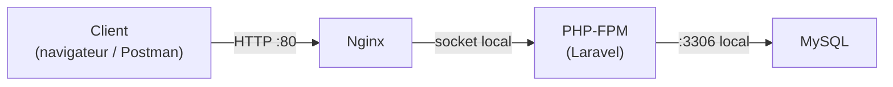

# Simplon Maroc - Dev Backend

# Sprint DevOps (ThreadForge Part 2) - Semaine 1 - Séance 3 : Déploiement manuel de ThreadForge sur la VM

## Objectifs pédagogiques

- Comprendre comment une app Laravel est servie en production : Nginx → PHP-FPM → Laravel → MySQL
- Installer la stack serveur complète sur la VM Ubuntu
- Déployer ThreadForge à la main, de `git clone` jusqu'à la première requête HTTP depuis l'extérieur
- Ressentir le coût du déploiement manuel — c'est exactement ce que le pipeline automatisera

## Objectifs techniques

apt, Nginx, PHP-FPM, extensions PHP, Composer, MySQL server, git clone, `.env` de production, `migrate --force`, permissions www-data, server block Nginx, queue worker

**Déroulé de la séance (Type Atelier, 2h)** :

- 0–10 min : Reconnexion à la VM (⚠️ l'IP a peut-être changé après le deallocate) + rappel du trajet d'une requête
- 10–25 min : Théorie courte : qui fait quoi entre Nginx, PHP-FPM et Laravel (section 1)
- 25–105 min : LAB - Déploiement manuel guidé (section 2)
- 105–115 min : Test croisé : chacun envoie une requête sur la VM d'un autre binôme
- 115–120 min : Récap + compter les étapes (section 3) + **deallocate**

---

## 1. Qui fait quoi : le trajet d'une requête en production

En local, `php artisan serve` fait tout. En production, trois acteurs se partagent le travail :

- **Nginx** : reçoit les requêtes HTTP sur le port 80. Sert directement les fichiers statiques, et transmet tout le reste à PHP-FPM.
- **PHP-FPM** : le moteur PHP qui exécute Laravel. Nginx et lui communiquent par un socket local.
- **MySQL** : écoute sur le port 3306, **en local uniquement** — jamais exposé au monde (cf. veille sur les ports).



Pourquoi pas `php artisan serve` en production ? C'est un serveur de développement : mono-processus, lent, non sécurisé, et il meurt quand on ferme le terminal. Nginx + PHP-FPM tournent en services système, gèrent des centaines de requêtes simultanées, et redémarrent seuls avec la machine.

---

## 2. LAB - Déploiement manuel de ThreadForge (80 min)

**Objectif** : à la fin, `http://<IP_PUBLIQUE>/api/...` répond depuis n'importe où dans le monde.

**Prérequis** : VM démarrée, connexion SSH fonctionnelle (`ssh threadforge-vm`), repo ThreadForge à jour sur GitHub.

### Étape 1 - Mettre à jour la VM (5 min)

```bash
sudo apt update && sudo apt upgrade -y
```

> `update` rafraîchit la liste des paquets, `upgrade` installe les mises à jour. Toujours faire ça sur une machine fraîche.

### Étape 2 - Installer la stack (10 min)

```bash
sudo apt install -y nginx mysql-server php8.3-fpm php8.3-mysql php8.3-xml php8.3-mbstring php8.3-curl php8.3-zip php8.3-bcmath php8.3-intl git unzip
```

Installer Composer (globalement) :

```bash
curl -sS https://getcomposer.org/installer | php
sudo mv composer.phar /usr/local/bin/composer
```

Vérifier :

```bash
php -v          # PHP 8.3.x
composer -V
nginx -v
mysql --version
```

> Si `composer install` râle plus tard sur la version PHP exigée par le projet : `sudo add-apt-repository ppa:ondrej/php` puis installer `php8.4-*` avec les mêmes extensions.

Premier test immédiat : ouvrir `http://<IP_PUBLIQUE>` dans le navigateur → la page **« Welcome to nginx! »** s'affiche. Le port 80 du NSG fonctionne, Nginx tourne. Si rien ne s'affiche : vérifier le NSG (séance 2) et `sudo systemctl status nginx`.

### Étape 3 - Créer la base de données (5 min)

```bash
sudo mysql
```

Dans le shell MySQL :

```sql
CREATE DATABASE threadforge;
CREATE USER 'threadforge'@'localhost' IDENTIFIED BY 'UN_MOT_DE_PASSE_ROBUSTE';
GRANT ALL PRIVILEGES ON threadforge.* TO 'threadforge'@'localhost';
FLUSH PRIVILEGES;
EXIT;
```

> `'threadforge'@'localhost'` : cet utilisateur ne peut se connecter que depuis la machine elle-même. MySQL n'est pas exposé, et ne le sera jamais.

### Étape 4 - Cloner le projet (5 min)

```bash
cd /var/www
sudo git clone https://github.com/<votre-user>/<votre-repo>.git threadforge
sudo chown -R $USER:$USER threadforge
cd threadforge
```

> Repo privé : GitHub refuse le mot de passe en HTTPS. Utiliser un **Personal Access Token** (GitHub → Settings → Developer settings → Fine-grained tokens, accès en lecture au repo) comme mot de passe.

### Étape 5 - Installer les dépendances (5 min)

```bash
composer install --no-dev --optimize-autoloader
```

> `--no-dev` : pas de Pest ni des outils de dev en production. `--optimize-autoloader` : autoloader plus rapide. Comparez avec votre `composer install` local : c'est la première différence dev/prod.

### Étape 6 - Configurer le `.env` de production (10 min)

```bash
cp .env.example .env
nano .env
```

Les lignes qui changent par rapport au local :

```env
APP_ENV=production
APP_DEBUG=false
APP_URL=http://<IP_PUBLIQUE>

DB_CONNECTION=mysql
DB_HOST=127.0.0.1
DB_DATABASE=threadforge
DB_USERNAME=threadforge
DB_PASSWORD=UN_MOT_DE_PASSE_ROBUSTE

QUEUE_CONNECTION=database

XAI_API_KEY=votre_cle_grok
```

Puis :

```bash
php artisan key:generate
php artisan migrate --force
```

> **`APP_DEBUG=false` est non négociable en production** : avec `true`, chaque erreur affiche votre code, vos requêtes SQL et parfois vos secrets à n'importe quel visiteur. Le `--force` de migrate : Laravel demande confirmation en production, le flag la donne.

### Étape 7 - Donner les bons droits (5 min)

Nginx/PHP-FPM tournent sous l'utilisateur `www-data`. Laravel doit pouvoir écrire ses logs et son cache :

```bash
sudo chown -R www-data:www-data /var/www/threadforge/storage /var/www/threadforge/bootstrap/cache
```

> L'erreur 500 « Permission denied » sur `storage/logs/laravel.log` est LE grand classique du premier déploiement. Vous venez de l'éviter.

### Étape 8 - Configurer Nginx (15 min)

Créer le server block :

```bash
sudo nano /etc/nginx/sites-available/threadforge
```

Contenu (config Laravel officielle, simplifiée) :

```nginx
server {
    listen 80;
    server_name _;
    root /var/www/threadforge/public;

    index index.php;

    location / {
        try_files $uri $uri/ /index.php?$query_string;
    }

    location ~ \.php$ {
        include snippets/fastcgi-php.conf;
        fastcgi_pass unix:/run/php/php8.3-fpm.sock;
    }

    location ~ /\.(?!well-known).* {
        deny all;
    }
}
```

Trois lignes à comprendre :

- `root .../public` : on expose **uniquement** le dossier `public/`, jamais la racine du projet (sinon `.env` serait téléchargeable par n'importe qui).
- `try_files ... /index.php?$query_string` : toute URL qui n'est pas un fichier réel part vers Laravel — c'est le routing.
- `fastcgi_pass unix:...` : le socket local vers PHP-FPM (le « tuyau » du schéma de la section 1).

Activer et recharger :

```bash
sudo ln -s /etc/nginx/sites-available/threadforge /etc/nginx/sites-enabled/
sudo rm /etc/nginx/sites-enabled/default
sudo nginx -t          # DOIT afficher "syntax is ok"
sudo systemctl reload nginx
```

### Étape 9 - Le moment de vérité (10 min)

Depuis **votre poste** (pas la VM), avec curl ou Postman :

```bash
curl http://<IP_PUBLIQUE>/api/register -X POST \
  -H "Content-Type: application/json" \
  -H "Accept: application/json" \
  -d '{"name":"test","email":"test@test.com","password":"password123","password_confirmation":"password123"}'
```

Puis un login, récupérer le token, et appeler un endpoint protégé avec `Authorization: Bearer <token>`. **Votre API tourne sur Internet.** Envoyez l'IP à votre binôme : il doit pouvoir s'inscrire depuis chez lui.

### Étape 10 - Le queue worker : la douleur volontaire (10 min)

Testez un endpoint qui déclenche l'appel IA (Job async)... rien ne se passe. Normal : **personne ne consomme la queue**. En local vous lanciez `php artisan queue:work` dans un terminal. Faites pareil ici :

```bash
php artisan queue:work
```

Le Job part, l'IA répond. Maintenant, fermez votre session SSH et retestez depuis Postman : **le worker est mort avec votre session**. Notez ce problème — on ne le corrige pas aujourd'hui. Retenez juste : un process lancé à la main dans un terminal SSH n'est pas un service de production. (Solution propre : un service systemd — prochaines séances.)

### Validation du LAB

- [ ] `http://<IP_PUBLIQUE>` répond (l'API, plus la page Nginx)
- [ ] Register + login + endpoint protégé fonctionnent depuis un poste externe
- [ ] `APP_DEBUG=false` vérifié (provoquer une 404 : pas de stack trace visible)
- [ ] Un binôme externe a réussi une requête sur votre IP
- [ ] Le problème du queue worker est constaté et noté

### En cas de blocage

| Problème | Solution |
| --- | --- |
| Page Nginx par défaut au lieu de l'API | Le site `default` est encore actif : `sudo rm /etc/nginx/sites-enabled/default` puis reload |
| Erreur 502 Bad Gateway | PHP-FPM éteint ou mauvais socket : `sudo systemctl status php8.3-fpm`, vérifier la ligne `fastcgi_pass` |
| Erreur 500 | `tail -50 storage/logs/laravel.log` sur la VM. Si le log lui-même est en Permission denied → refaire l'étape 7 |
| `SQLSTATE Access denied` | Mot de passe du `.env` ≠ celui du CREATE USER. Refaire l'un des deux |
| curl « Connection refused / timeout » | NSG : vérifier que le port 80 est bien ouvert (séance 2) |
| `git clone` demande un mot de passe qui échoue | Repo privé : utiliser un Personal Access Token |
| Ça marchait, plus rien après un deallocate | L'IP publique a changé : la récupérer dans le Portal, mettre à jour `~/.ssh/config` |

---

## 3. Comptez vos étapes

Vous venez d'exécuter environ **40 commandes** réparties sur 10 étapes, avec au moins un piège par étape. Maintenant la vraie question : votre binôme pousse un fix demain matin. **Qui refait tout ça ? À quelle heure ? Avec quelles erreurs ?**

C'est exactement le samedi soir de Karim (séance 1). Regardez bien vos 40 commandes : elles se divisent en deux familles. Les étapes d'**installation** (apt, Nginx, MySQL, PHP...) — faites une fois, refaites seulement si le serveur change. Et les étapes de **livraison** (pull, composer install, migrate, redémarrages) — refaites à **chaque nouvelle version**. Vous avez déjà la CI qui teste chaque push ; il manque la moitié droite du pipeline : que chaque push validé se **livre tout seul**. Gardez vos notes de douleur.

### Les 3 points clés à retenir

- En production : Nginx reçoit (port 80), PHP-FPM exécute, MySQL reste local. `php artisan serve` n'existe pas en prod.
- On n'expose que `public/`, `APP_DEBUG=false` toujours, et la base n'est jamais accessible de l'extérieur.
- Un process lancé dans un terminal SSH meurt avec le terminal : le queue worker attend sa vraie solution.

### Prochaine séance

Le **CD** (Continuous Deployment) : les étapes de livraison d'aujourd'hui (pull, composer install, migrate, restart) deviennent d'abord un script sur la VM, puis un job GitHub Actions qui s'exécute automatiquement **après le check vert de la CI**. Push → tests → déployé. Le queue worker recevra aussi sa vraie solution : un service systemd qui survit à la fermeture du terminal.
